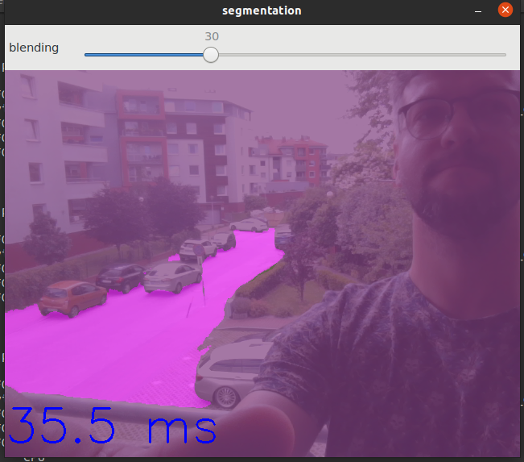

# Openvino segmentation demo working in Docker container (Ubuntu 18.04)

This repo contains my recent story with OpenVino (Intel) librray.

One can find here the Docker configuration working with camera input image.

Everything was working on my laptop Dell XPS 9570 with Ubuntu 20.04.


# Installation
**CPU**
> `make build-cpu`

**GPU**
> `make build-gpu`

The installation process builds the image of Ubuntu 18.04 with
- OpenCV
- OpenVino toolkit
- python3 with TF and PyToch

The building process also:
- compiles all OpenVino demos (in C++) from deployment tools
- downloads the following models for segmentation demo:
  - `semantic-segmentation-adas-0001` (in OpenVino binary format)
  - `road-segmentation-adas-0001` (in OpenVino binary format)
  - `deeplabv3_mnv2_pascal_train_aug` (inf TF format)
- optimize the `deeplabv3_mnv2_pascal_train_aug` and saves it in OpenVino binary format

# Run segmentation demo with camera input
One can start the segmentation demo with laptop's camera as input in few steps
**Step 1.** Crete and runt the docker container (with camera device support)
> `make run-shell-with-camera-cpu`

**Step 2.** In the docker container, run the command
> `/home/openvino/omz_demos_build/intel64/Release/segmentation_demo -i 0 -m MODEL_PATH`
where `MODEL_PATH` is path to XML file of the model.
In case of FP32 precision, one can choose:
- `/home/openvino/models/intel/semantic-segmentation-adas-0001/FP32/semantic-segmentation-adas-0001.xml`
- `/home/openvino/models/intel/road-segmentation-adas-0001/FP32/road-segmentation-adas-0001.xml`
- `/home/openvino/models/public/deeplabv3-bin/FP32/frozen_inference_graph.xml`

One can quit the demo by pressing `q`.

## Performance results (milisecond per frame, lower is better)

| Model                           | FP16-INT8 | FP16 | FP32 |
|---------------------------------|-----------|------|------|
| semantic-segmentation-adas-0001 | 190 ms    | 260 ms | 267 ms |
| road-segmentation-adas-0001     |   32 ms       |  36.2 ms   |  37.0 ms    |
| deeplabv3_mnv2_pascal_train_aug |    ---      |  60 ms    | 60 ms  |

Conclusions:
1. One can observe that `semantic-segmentation-adas` model is quite slow.
2. Road segmentation works well but only with roads :-). It is FAST, by the way. 
3. For human body semantic segmengtation, I would recommend deeplab since it is quite accurate and fast (see the first image and video).

# Run segmentation demo on single [image.jpg](img/image.jpg)
One can simply run the `segmentation_demo` (from OpenVino deployment tools) in few steps

**Step 1.** Create the docker container and run the shell
> `make run-shell-cpu`

**Step 2.** In the docker container, run the shell script [run_segmentation_demo_with_single_image.sh](scripts/run_segmentation_demo_with_single_image.sh)
> `bash scripts/run_segmentation_demo_with_single_image.sh`

## Performance and results

Below we give the results obtained by running the script. One can observe the similar performance when runing the segmentation_demo in the mode without camera input and without GTK window.
```
*********************
Model semantic-segmentation-adas-0001
PREC FP16-INT8
[ INFO ] InferenceEngine: 0x7f4f9538c040
[ INFO ] Parsing input parameters
[ INFO ] Device info
	CPU
	MKLDNNPlugin version ......... 2.1
	Build ........... 2020.3.0-3467-15f2c61a-releases/2020/3
Mean pipeline latency: 213.5 ms

[ INFO ] Execution successful
*********************
Model semantic-segmentation-adas-0001
PREC FP16
[ INFO ] InferenceEngine: 0x7fa8d6263040
[ INFO ] Parsing input parameters
[ INFO ] Device info
	CPU
	MKLDNNPlugin version ......... 2.1
	Build ........... 2020.3.0-3467-15f2c61a-releases/2020/3
Mean pipeline latency: 277.8 ms

[ INFO ] Execution successful
*********************
Model semantic-segmentation-adas-0001
PREC FP32
[ INFO ] InferenceEngine: 0x7fbb1b786040
[ INFO ] Parsing input parameters
[ INFO ] Device info
	CPU
	MKLDNNPlugin version ......... 2.1
	Build ........... 2020.3.0-3467-15f2c61a-releases/2020/3
Mean pipeline latency: 275.1 ms

[ INFO ] Execution successful
*********************
Model road-segmentation-adas-0001
PREC FP16-INT8
[ INFO ] InferenceEngine: 0x7fe37d9cd040
[ INFO ] Parsing input parameters
[ INFO ] Device info
	CPU
	MKLDNNPlugin version ......... 2.1
	Build ........... 2020.3.0-3467-15f2c61a-releases/2020/3
Mean pipeline latency: 35.4 ms

[ INFO ] Execution successful
*********************
Model road-segmentation-adas-0001
PREC FP16
[ INFO ] InferenceEngine: 0x7f958615d040
[ INFO ] Parsing input parameters
[ INFO ] Device info
	CPU
	MKLDNNPlugin version ......... 2.1
	Build ........... 2020.3.0-3467-15f2c61a-releases/2020/3
Mean pipeline latency: 37.7 ms

[ INFO ] Execution successful
*********************
Model road-segmentation-adas-0001
PREC FP32
[ INFO ] InferenceEngine: 0x7f87d7d7e040
[ INFO ] Parsing input parameters
[ INFO ] Device info
	CPU
	MKLDNNPlugin version ......... 2.1
	Build ........... 2020.3.0-3467-15f2c61a-releases/2020/3
Mean pipeline latency: 37.9 ms

[ INFO ] Execution successful
*********************
Model deeplabv3-bin
PREC FP16
[ INFO ] InferenceEngine: 0x7f1d5c860040
[ INFO ] Parsing input parameters
[ INFO ] Device info
	CPU
	MKLDNNPlugin version ......... 2.1
	Build ........... 2020.3.0-3467-15f2c61a-releases/2020/3
Mean pipeline latency: 59.6 ms

[ INFO ] Execution successful
*********************
Model deeplabv3-bin
PREC FP32
[ INFO ] InferenceEngine: 0x7fbb7ed73040
[ INFO ] Parsing input parameters
[ INFO ] Device info
	CPU
	MKLDNNPlugin version ......... 2.1
	Build ........... 2020.3.0-3467-15f2c61a-releases/2020/3
Mean pipeline latency: 59.7 ms

[ INFO ] Execution successful
```
